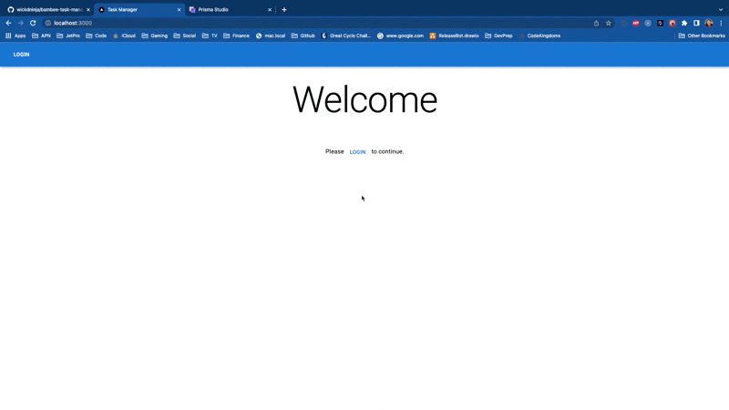

# Task Manager

## Implementation Steps / Thought Process

### Setup

- create new nextjs typescript app ( creates directory structure )
  - `yarn create next-app --typescript task-manager`
  - clear out scaffolded page html `index.tsx` / styles `Home.module.css` / api `api/hello.ts`
  - setup vscode debugger [launch.json](https://gist.github.com/wickdninja/eeabefa3d38e545edc3dec673c6b5720)
  - add prettier rules
- start docker compose file
  - setup postgres
- start db
  - `docker-compose up`
- install/setup prisma
  - `yarn add prisma --dev`
  - `yarn prisma init`
  - update .env file
  - create schema with prisma ( include mappings for nextauth )
  - push schema to db
    - `yarn prisma db push`
  - check models with prisma studio
    - `yarn prisma studio`
      - seeded with 1 test user and 1 test task
  - install client
    - `yarn add @prisma/client`
  - generate client
    - `yarn prisma generate`
  - expose prisma client (singleton when local to avoid too many clients error)
    - `lib/prisma.ts`
    - install node types
      - `yarn add @types/node`
- setup auth
  - `npm install next-auth@4 @next-auth/prisma-adapter`
    - I experienced a yarn error due to using newer node version (currently using 18.x ).. normally would dig in deeper and resolve using the same package manager / lock file consistently, or use `nvm`, but for this exercise I just need the dependencies. So I switched to `npm`
  - update schema for nextauth
  - push schema changes
    - `yarn prisma db push`
  - create github oauth app
    - `http://localhost:3000/api/auth`
    - update `.env`
      - client id, secret, callback url
  - update `_app.tsx` to use the session provider
  - update `index.tsx`
    - spiked out a simple page with auth status and a link to login if not auth'd
  - add api routes for nextauth
    - `pages/api/auth/[...nextauth].ts`
  - test auth
    - originally didn't work ... found I had introduced a typo after I had copy/paste the client secret

### Frontend

- install MUI component lib
  - https://mui.com/material-ui/getting-started/installation/
- threw away spike re-implemented with MUI components
  - tool bar with app name and login button
  - when authenticated show name and image
  - updated index to show task list or welcome text / login
- list
  - created static list to layout / design list
    - I decided to just render the date for simplicity ( skipping "today" / "tomorrow") for now due to time constraints
      - I would make use of a date library such as DateFns to assist with this normally
- detail
  - created layout component to share basic layout across pages
  - created detail page with static data to design / layout quickly

### Backend + Frontend Integration

- SSR list
- hydrate list on client with SWR (stale-while-revalidate)
- implement on check changed behavior
- SSR detail
- implement / integrate "save": client sends hydrated DTO to PUT api
- implement / integrate "delete": client sends ID to delete API

### Clean Up

- rebased branch and squashed commits
- created demo gif
- published repo to Github

## High Level Milestones For Production

### Define "success"

Targets, metrics, KPIs, security constraints/goals, compliance / auditing requirements, etc.

### Design with success in mind

Discover and define as many "unknowns" as possible... sometimes this means a spike to discover what we do not know.
For example:

- Determine how the different services would be hosted
  - Which cloud (AWS, Google, Azure, etc)?
    - If AWS, what service/s?
      - app: (Fargate, Lambda, EKS, etc)?
      - db: (RDS, Aurora, EKS, etc)?
- and many other unknowns (networking, security groups, service roles, access policies, availability concerns, scalability concerns, etc)

### Cloud Native / Immutable Infastructure

Codify the infastructure to be immuatable and repeatable: (terraform, cloudformation, pulumi, CDK, etc)

### CI / CD

Create actions / pipelines that

- Verify PRs before merging
  - Build,test, maybe deploy to a test environment where it can be acceptace tested by automation, a dev, or QA
- Continuously delivery changes on "main" to QA and / or any other pre-production environments
- Continuously delivery changes on "main" to Production (with an approval "gate")
  - `"gate"`: Whatever the business requires for a production release ( docs, sign off, etc.. automate as much as humanly possible )

### Observability

System monitoring (log collection, distributed tracing, metrics, etc.) that

- allows Engineering to keep the system "highly available"
- allows Ops to effectively and effeciently support the system
- allows the Business to accurately measure "success"

### UX

***depending on business needs these can be "nice to haves" instead of **hard** requirements but can significantly increase engagement and conversion rates***

- animations
- page transistions
- optimize TTFMP (time to first meaningful paint)
- error boundaries
- monitoring / tracking
  - user experience monitoring can allow you to identify critical points in the business process that increase/decrease conversion rates.
- A/B testing ( requires observability to measure the different cases )
